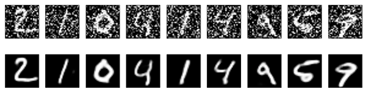
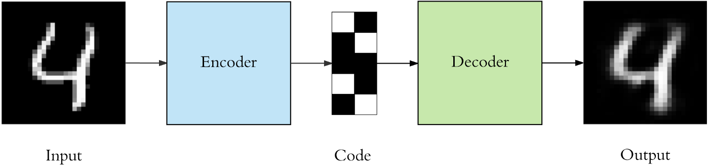

# Image Denoising using Convolutional Autoencoders

- [Image Denoising using Convolutional Autoencoders](#image-denoising-using-convolutional-autoencoders)
  - [About](#about)
  - [Autoencoders](#autoencoders)
  - [Results](#results)
  - [References](#references)

## About 

We can use convolutional autoencoders to work on an image denoising problem. We need to train the autoencoder to map noisy digits images to clean digits images.

Since our inputs are images, it makes sense to use convolutional neural networks (convnets) as encoders and decoders. In practical settings, autoencoders applied to images are always convolutional autoencoders --they simply perform much better.

We'll be using the MNIST hand-written digits dataset. We generate synthetic noisy digits by applying a gaussian noise matrix and clip the images between 0 and 1.

## Autoencoders

Autoencoders are a specific type of neural networks where the output is the same as the input. They compress the input into a lower-dimensional *code* and then reconstruct the output from this representation. 

They are essentially a dimensionality reduction algorithm with some important properties:
  * **Data-specific:** Autoencoders are only able to meaningfully compress data similar to what they have been trained on. Since they learn features specific for the given training data, they are different than a standard data compression algorithm like gzip. So we can’t expect an autoencoder trained on handwritten digits to compress landscape photos
  * **Lossy:** The output of an autoencoder will be a degraded version of the input
  * **Unsupervised:** The compression and decompression functions are learned automatically from examples

## Results

It seems to work pretty well. If you scale this process to a bigger convnet, you can start building document denoising or audio denoising models. Kaggle has an interesting dataset to get you started.

## References
1. https://blog.keras.io/building-autoencoders-in-keras.html
2. https://towardsdatascience.com/anomaly-detection-for-dummies-15f148e559c1
3. https://towardsdatascience.com/applied-deep-learning-part-3-autoencoders-1c083af4d798