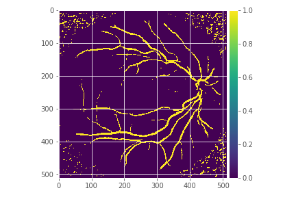
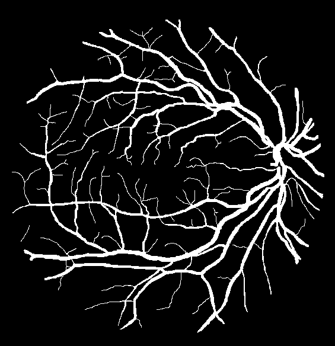

# Retinal Vasculature Segmentation using U-net 

  - [About](#about)
  - [Dataset](#dataset)
  - [Results](#results)

--- 

## About

The retinal vascular condition is a reliable biomarker of several ophthalmologic and cardiovascular diseases, so automatic vessel segmentation may be crucial to diagnose and monitor them. 

U-Net's are the current SoTA for biomedical image segmentation tasks. As written by the author's in their paper: 
> *The architecture consists of a contracting path to capture context and a symmetric expanding path that enables precise localization*

U-Net's can learn from relatively less amount of data than conventional CNNs which makes them ideal for biomedical image analysis. 

## Dataset

I've used the [DRIVE](https://www.isi.uu.nl/Research/Databases/DRIVE/) dataset for training the network. The dataset is divided into *training* and *test* sets, each containing 20 retinal images and their vessel masks.

I've divided the original dataset into 'train', 'val' and 'test'.

## Results

The model achieved an accuracy of **0.9548** on the test set.

One of the predicted masks is shown below:

Groundtruth of the image is:

